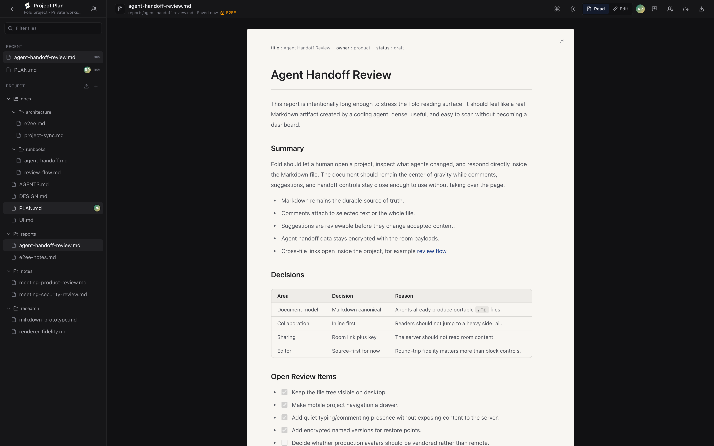

# Fold

Encrypted Markdown project rooms for humans and coding agents.

Fold is an early working OSS alpha for private Markdown project rooms. Publish a `.md` file or small Markdown project directory, share a `/room/:roomId#key=...` link, collaborate in the browser, and let coding agents submit encrypted review proposals from the CLI while the server stores opaque room payloads plus minimal routing metadata.

Fold is not production-hardened yet, but it is no longer just a spike: this repo includes a functional TypeScript CLI, a file-backed encrypted append-log server, and an early web room app.



Start with [PLAN.md](PLAN.md) for the product and architecture direction.

## Fastest Hosted Path

The recommended hosted alpha path is a single Node service that serves both the web app and encrypted append-log sync from one public origin:

```bash
npm install
npm run build
npm start
```

Set `FOLD_PUBLIC_URL` to the HTTPS URL people open, and set `FOLD_DATA_DIR` to a persistent volume path if your host provides one:

```bash
FOLD_PUBLIC_URL=https://your-fold.example
FOLD_DATA_DIR=/persistent/fold/append-log
```

Then create a room and copy a human or agent handoff:

```bash
npm run --silent cli -- room create --alias launch --json
npm run --silent cli -- room invite launch --for human
npm run --silent cli -- room invite launch --for agent
```

See [docs/deploy.md](docs/deploy.md) for generic Node host, split web/sync, WebSocket, Docker, Compose, and persistence notes.

## Current Status

Fold currently supports local/self-hosted alpha workflows:

- publish a Markdown file or directory into an encrypted room;
- save local room aliases in `.fold/rooms.json`;
- replay encrypted room history through the CLI and web app;
- export accepted Markdown back to `.md` files or a project directory;
- submit, inspect, accept, and reject encrypted agent proposals;
- derive proposal status by replaying encrypted room events client-side;
- open rooms in a Next.js web app with Markdown read/edit, project files, file comments, early inline-style review context, proposal review, file restore points, encrypted ephemeral presence, and human/agent invites.

The server stores encrypted room records plus plaintext routing metadata only: `roomId`, append-log `seq`, and `senderId`. Markdown, project files, proposals, comments, timeline/status events, file versions, and personas are encrypted client-side before durable storage. Presence is also encrypted client-side, but it is broadcast over WebSocket only and is not stored in the durable append log.

Fold is alpha software. It has not been security-audited, and production durability, access control, fork/truncation protection, compaction, key rotation, and deployment hardening remain open.

## Local Development

Install dependencies:

```bash
npm install
```

Start the append-log server:

```bash
npm run server -- --port 8787 --data ./data
curl http://127.0.0.1:8787/health
```

Start the web app in another terminal:

```bash
npm run web:dev
```

Publish a Markdown file or directory:

```bash
npm run --silent cli -- publish ./README.md \
  --app-url http://127.0.0.1:3000 \
  --sync-url http://127.0.0.1:8787 \
  --alias readme \
  --json
```

Open the printed `room.url`. The URL fragment contains the room key, so treat the full URL as secret.

Use `--silent` when parsing JSON from `npm run`; otherwise npm can print banners before the CLI output.

Routine command JSON redacts room access material. Use aliases or explicit invite/publish/create outputs when a workflow intentionally needs a secret room URL or `fold:v1:` token.

## How To Think About Fold

- A room is the collaboration unit: one Markdown file or a small Markdown project tree.
- A room URL is the sharing unit: `/room/:roomId#key=...`.
- The server stores encrypted records plus routing metadata; clients decrypt and replay room state.
- Accepted Markdown is portable and exportable. Agent edits are proposals until accepted.
- The browser is for humans to read, edit, comment, review, and copy invites. The CLI is the stable agent interface.

## Human Workflow

Create or publish a room:

```bash
npm run --silent cli -- publish ./project \
  --app-url http://127.0.0.1:3000 \
  --sync-url http://127.0.0.1:8787 \
  --alias launch \
  --json
```

Invite a human:

```bash
npm run --silent cli -- room invite launch --for human
```

Review agent proposals:

```bash
npm run --silent cli -- proposals --room launch --json
npm run --silent cli -- show-proposal "<proposal-id>" --room launch --json
npm run --silent cli -- accept "<proposal-id>" --room launch --json
npm run --silent cli -- reject "<proposal-id>" --room launch --json
```

Export accepted Markdown:

```bash
npm run --silent cli -- export --room launch --output ./exported-project --json
```

## Agent Workflow

Agents should join with an invite token or room URL, export accepted state, edit locally, and submit a reviewable proposal instead of overwriting accepted content.

```bash
npm run --silent cli -- room add "fold:v1:..." --alias launch --json
npm run --silent cli -- status --room launch --json
npm run --silent cli -- export --room launch --output ./accepted-project --json
```

After editing files locally:

```bash
npm run --silent cli -- propose ./accepted-project \
  --room launch \
  --title "Update project docs" \
  --comment "Clarifies the README and preserves portable Markdown export." \
  --json
```

Inspect the queue:

```bash
npm run --silent cli -- proposals --room launch --json
npm run --silent cli -- show-proposal "<proposal-id>" --room launch --json
```

If an agent creates the room first, it can generate separate human and agent invites:

```bash
npm run --silent cli -- room invite launch --for human
npm run --silent cli -- room invite launch --for agent
```

## CLI Commands

See [docs/cli.md](docs/cli.md) for the full reference.

Current command set:

```bash
fold publish <file-or-directory> [--server <url>] [--app-url <url>] [--sync-url <url>] [--alias <name>] [--path <room-path>] [--json] [--no-save]
fold room create --alias <name> [--server <url>] [--app-url <url>] [--sync-url <url>] [--json]
fold room add <url-or-token> --alias <name> [--json]
fold room list [--json]
fold room show <alias> [--json]
fold room set-url <alias> [--app-url <url>] [--sync-url <url>] [--json]
fold room forget <alias> [--json]
fold room invite <alias> [--for human|agent] [--json]
fold status --room <alias-or-url-or-token> [--json]
fold export --room <alias-or-url-or-token> [--path <room-path>] [--output <file-or-directory>] [--json]
fold propose <file-or-directory> --room <alias-or-url-or-token> [--path <room-path>] [--title <text>] [--comment <text>] [--json]
fold proposals --room <alias-or-url-or-token> [--json]
fold comments --room <alias-or-url-or-token> [--path <room-path>] [--type all|comment|request] [--open] [--json]
fold requests --room <alias-or-url-or-token> [--path <room-path>] [--no-open] [--json]
fold comment --room <alias-or-url-or-token> --text <text> [--path <room-path>] [--quote <text>] [--type comment|request] [--json]
fold reply <comment-id> --room <alias-or-url-or-token> --text <text> [--json]
fold context --room <alias-or-url-or-token> [--json]
fold show-proposal <proposal-id> --room <alias-or-url-or-token> [--json]
fold accept <proposal-id> --room <alias-or-url-or-token> [--json]
fold reject <proposal-id> --room <alias-or-url-or-token> [--json]
fold patch <file.md> --room <alias-or-url-or-token> [--path <room-path>] [--summary <text>] [--json]
```

`patch` is a compatibility wrapper around proposal submission.

## Security Model

Fold uses a private room-link model:

```text
/room/:roomId#key=...
```

The `#key` fragment contains client-side room key material and is not sent to server APIs. The CLI can also store the same key material in a local `fold:v1:` token or `.fold/rooms.json`; treat those as secrets. Browser recent projects store non-secret convenience metadata by default, not room keys, so reopening a recent room without a URL fragment asks for the key again.

Clients derive a room key locally with HKDF-SHA256:

- salt: `fold:${roomId}`
- info: `yjs-update-append-log:v1`
- cipher: AES-GCM-256

Clients encrypt room payloads before sending them to the sync server. The server appends and broadcasts records shaped like:

```ts
{ roomId, seq, senderId, nonce, ciphertext }
```

Durable encrypted payloads include document Markdown updates, project snapshots, proposal records, proposed Markdown, diffs, comments, timeline events, proposal status events, file versions, and persona metadata. Ephemeral presence payloads are encrypted and broadcast live over WebSocket, but they are not appended to room history.

The server can still see plaintext routing metadata:

- `roomId`
- append-log `seq`
- `senderId`
- record counts and latest sequence
- request timing and network metadata

Some `senderId` values reveal the kind of record being sent, such as document update, project snapshot, proposal, timeline event, comment, version, or ephemeral presence.

### Alpha Security Limitations

Fold's current E2EE implementation protects room content from the server, but it is not a complete production security system yet.

Known limitations:

- no security audit yet;
- no account authentication, ACLs, or write authorization;
- anyone with a `roomId` can currently fetch or append encrypted records;
- malicious or malformed appends can affect availability;
- no malicious-server fork detection;
- no suffix truncation detection;
- no hash chain or signed checkpoint protocol;
- no append-log compaction;
- no production-grade database durability or multi-process write safety;
- no key rotation or link revocation yet;
- no admin recovery if the room key is lost.

If you lose the room key, Fold cannot recover encrypted room contents for you.

This is a private-link model, not an account permission model. Do not use the alpha for regulated, safety-critical, or irreplaceable production data.

## Document Model

Fold keeps raw Markdown as durable room state.

The accepted document is Markdown-canonical, represented as `Y.Text` named `markdown`, and exported as ordinary `.md` files. Multi-file projects are represented as encrypted Markdown project snapshots keyed by project-relative paths.

Rich editor structures may be layered on later, but they remain helper or derived state until they prove lossless Markdown fidelity for agent-authored files. The document-model spike found that raw Markdown preserves frontmatter, GFM tasks/tables, Mermaid/math/code fences, links/images, and long agent reports byte-for-byte, while editor-canonical approaches still normalize or lose important Markdown details.

Read mode uses `react-markdown` with GFM, math, KaTeX, and sanitization. Mermaid fences render as safe placeholders today. Edit mode is currently source Markdown with frontmatter/property preservation.

See:

- [spikes/document-model/README.md](spikes/document-model/README.md)
- [spikes/document-model/COMPARISON.md](spikes/document-model/COMPARISON.md)

## What Works Today

- TypeScript CLI for publishing, exporting, status, proposals, accept/reject, room aliases, and invites.
- File-backed HTTP/WebSocket encrypted append-log server.
- Encrypted WebSocket backlog replay and live record broadcast.
- Local room aliases in `.fold/rooms.json`.
- Markdown file and directory publishing.
- Accepted Markdown export to file or directory.
- Encrypted proposal records with diffs, personas, and timeline events.
- Proposal status derived by encrypted event replay, not trusted plaintext server state.
- Redacted `fold context --room` packets for agent handoff.
- Next.js web room app at `/room/:roomId#key=...`.
- Web room unlock with key fragment/manual key flow.
- Project file tree, recent files, local Markdown import, current-file export.
- Sanitized Markdown read mode with GFM and math support.
- Source Markdown edit mode.
- File comments, early inline-style review context, proposal review, file restore points, encrypted ephemeral presence activity, and agent handoff copy.

## Still Hardening

- Production durability and crash recovery.
- Append-log compaction.
- Malicious-server fork/truncation detection.
- Hash chains or signed checkpoints.
- Account auth, ACLs, and write authorization.
- Key rotation and link revocation.
- Multi-process file-store safety.
- Deployment hardening.
- Richer editor integration and lossless Markdown editing.
- More robust inline comment anchoring and suggestion semantics.
- Broader security review.

## Repository Map

- `src/cli/` — TypeScript CLI built with `@stricli/core`.
- `src/server/` — HTTP/WebSocket encrypted append-log server.
- `src/rooms/` — room references, `fold:v1:` tokens, project snapshots, proposals, timeline replay, personas, and local room metadata.
- `apps/web/` — Next.js web app for creating/joining rooms and collaborating in `/room/:roomId`.
- `docs/cli.md` — CLI reference and agent workflow.
- `spikes/e2ee-yjs-append-log/` — executable E2EE append-log spike.
- `spikes/document-model/` — Markdown-canonical vs editor-canonical document model spike.
- `PLAN.md` — product and architecture direction.
- `DESIGN.md` / `UI.md` — web product direction.

## Verification

Core checks:

```bash
npm run check
```

The check script runs the unit tests, root typecheck, E2EE spike,
document-model spike, non-mutating document-model report check, web
typecheck, and web build.

To intentionally regenerate the tracked document-model comparison reports, run:

```bash
npm run spike:document-model:report:update
```

## Secrets

Treat room URLs with `#key=...`, `fold:v1:` tokens, and `.fold/rooms.json` as secrets. They contain client-side key material and grant decryption access. The CLI writes `.fold` with owner-only permissions and `.fold/rooms.json` with owner-read/write permissions where POSIX modes are supported. Browser recent-room storage is only a local index of room ids, display names, sources, visit times, and review counts by default.

Do not commit `.fold/rooms.json`.

## License

See [LICENSE](LICENSE).
