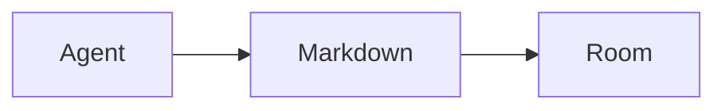
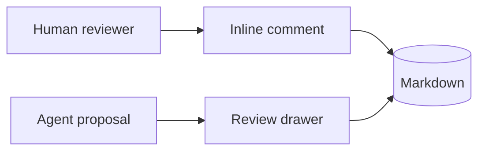

# Document Model Comparison Report

This report shows the same agent-authored Markdown samples through the durable Markdown model, plain ProseMirror serialization, Milkdown, and Milkdown with Fold properties.

- Markdown canonical keeps raw Markdown as the live `Y.Text` document.
- Editor canonical parses Markdown into a ProseMirror document and serializes it back with `prosemirror-markdown`.
- Milkdown candidate parses and serializes Markdown with Milkdown CommonMark plus GFM in a hidden jsdom harness.
- Milkdown with Fold properties keeps frontmatter/properties outside the editor body, matching the current web edit-mode strategy.

## agent-plan.md

### Summary

| Model | Exact round-trip | Preserved features | Lost features |
| --- | --- | --- | --- |
| Markdown canonical | yes | frontmatter, taskLists | none |
| Editor canonical | no | none | frontmatter, taskLists |
| Milkdown candidate | no | taskLists | frontmatter |
| Milkdown with Fold properties | no | frontmatter, taskLists | none |

### Original Markdown

````md
---
title: Agent Plan
owner: coding-agent
---

# Agent Plan

## Goals

- [ ] Build CLI publish
- [x] Verify E2EE spike
- [ ] Compare document models

## Notes

Agents should preserve Markdown as a portable artifact.


````

### Markdown-Canonical Export

````md
---
title: Agent Plan
owner: coding-agent
---

# Agent Plan

## Goals

- [ ] Build CLI publish
- [x] Verify E2EE spike
- [ ] Compare document models

## Notes

Agents should preserve Markdown as a portable artifact.


````

### Editor-Canonical Export

````md
---

## title: Agent Plan owner: coding-agent

# Agent Plan

## Goals

* \[ \] Build CLI publish
* \[x\] Verify E2EE spike
* \[ \] Compare document models

## Notes

Agents should preserve Markdown as a portable artifact.
````

### Milkdown Candidate Export

````md
***

title: Agent Plan
owner: coding-agent
-------------------

# Agent Plan

## Goals

* [ ] Build CLI publish

* [x] Verify E2EE spike

* [ ] Compare document models

## Notes

Agents should preserve Markdown as a portable artifact.

````

### Milkdown With Fold Properties Export

````md
---
title: Agent Plan
owner: coding-agent
---

# Agent Plan

## Goals

* [ ] Build CLI publish

* [x] Verify E2EE spike

* [ ] Compare document models

## Notes

Agents should preserve Markdown as a portable artifact.

````

## code-report.md

### Summary

| Model | Exact round-trip | Preserved features | Lost features |
| --- | --- | --- | --- |
| Markdown canonical | yes | tables, fencedCode, inlineCode | none |
| Editor canonical | no | fencedCode, inlineCode | tables |
| Milkdown candidate | no | tables, fencedCode, inlineCode | none |
| Milkdown with Fold properties | no | tables, fencedCode, inlineCode | none |

### Original Markdown

````md
# Code Report

The agent changed `client.ts` and verified the protocol hardening.

```ts
export function example(value: string): string {
  return value.trim();
}
```

```bash
npm test
npm run typecheck
```

## Findings

| Area | Status | Notes |
| --- | --- | --- |
| Sync | Pass | WebSocket backlog replay works |
| Crypto | Pass | Metadata is authenticated |
| UI | Pending | Not started |


````

### Markdown-Canonical Export

````md
# Code Report

The agent changed `client.ts` and verified the protocol hardening.

```ts
export function example(value: string): string {
  return value.trim();
}
```

```bash
npm test
npm run typecheck
```

## Findings

| Area | Status | Notes |
| --- | --- | --- |
| Sync | Pass | WebSocket backlog replay works |
| Crypto | Pass | Metadata is authenticated |
| UI | Pending | Not started |


````

### Editor-Canonical Export

````md
# Code Report

The agent changed `client.ts` and verified the protocol hardening.

```ts
export function example(value: string): string {
  return value.trim();
}
```

```bash
npm test
npm run typecheck
```

## Findings

| Area | Status | Notes | | --- | --- | --- | | Sync | Pass | WebSocket backlog replay works | | Crypto | Pass | Metadata is authenticated | | UI | Pending | Not started |
````

### Milkdown Candidate Export

````md
# Code Report

The agent changed `client.ts` and verified the protocol hardening.

```ts
export function example(value: string): string {
  return value.trim();
}
```

```bash
npm test
npm run typecheck
```

## Findings

| Area   | Status  | Notes                          |
| ------ | ------- | ------------------------------ |
| Sync   | Pass    | WebSocket backlog replay works |
| Crypto | Pass    | Metadata is authenticated      |
| UI     | Pending | Not started                    |

````

### Milkdown With Fold Properties Export

````md
# Code Report

The agent changed `client.ts` and verified the protocol hardening.

```ts
export function example(value: string): string {
  return value.trim();
}
```

```bash
npm test
npm run typecheck
```

## Findings

| Area   | Status  | Notes                          |
| ------ | ------- | ------------------------------ |
| Sync   | Pass    | WebSocket backlog replay works |
| Crypto | Pass    | Metadata is authenticated      |
| UI     | Pending | Not started                    |

````

## rich-agent-output.md

### Summary

| Model | Exact round-trip | Preserved features | Lost features |
| --- | --- | --- | --- |
| Markdown canonical | yes | fencedCode, mermaidFence, mathFence, inlineMath, links, images | none |
| Editor canonical | no | fencedCode, mermaidFence, mathFence, inlineMath, links, images | none |
| Milkdown candidate | no | fencedCode, mermaidFence, mathFence, inlineMath, links, images | none |
| Milkdown with Fold properties | no | fencedCode, mermaidFence, mathFence, inlineMath, links, images | none |

### Original Markdown

````md
# Rich Agent Output

## Mermaid



## Math

Inline math: $E = mc^2$.

Block math:

```math
\sum_{i=1}^{n} i = \frac{n(n+1)}{2}
```

## Links And Images

[Project repo](https://github.com/wanderingspirit03/fold)


````

### Markdown-Canonical Export

````md
# Rich Agent Output

## Mermaid


## Math

Inline math: $E = mc^2$.

Block math:

```math
\sum_{i=1}^{n} i = \frac{n(n+1)}{2}
```

## Links And Images

[Project repo](https://github.com/wanderingspirit03/fold)


````

### Editor-Canonical Export

````md
# Rich Agent Output

## Mermaid


## Math

Inline math: $E = mc^2$.

Block math:

```math
\sum_{i=1}^{n} i = \frac{n(n+1)}{2}
```

## Links And Images

[Project repo](https://github.com/wanderingspirit03/fold)


````

### Milkdown Candidate Export

````md
# Rich Agent Output

## Mermaid


## Math

Inline math: $E = mc^2$.

Block math:

```math
\sum_{i=1}^{n} i = \frac{n(n+1)}{2}
```

## Links And Images

[Project repo](https://github.com/wanderingspirit03/fold)


````

### Milkdown With Fold Properties Export

````md
# Rich Agent Output

## Mermaid


## Math

Inline math: $E = mc^2$.

Block math:

```math
\sum_{i=1}^{n} i = \frac{n(n+1)}{2}
```

## Links And Images

[Project repo](https://github.com/wanderingspirit03/fold)


````

## long-agent-handoff.md

### Summary

| Model | Exact round-trip | Preserved features | Lost features |
| --- | --- | --- | --- |
| Markdown canonical | yes | frontmatter, taskLists, tables, fencedCode, mermaidFence, mathFence, inlineMath, links, images, inlineCode | none |
| Editor canonical | no | fencedCode, mermaidFence, mathFence, inlineMath, links, images, inlineCode | frontmatter, taskLists, tables |
| Milkdown candidate | no | taskLists, tables, fencedCode, mermaidFence, mathFence, inlineMath, links, images, inlineCode | frontmatter |
| Milkdown with Fold properties | no | frontmatter, taskLists, tables, fencedCode, mermaidFence, mathFence, inlineMath, links, images, inlineCode | none |

### Original Markdown

````md
---
title: Agent Handoff Review
owner: review-agent
room: fold-ui
status: active
---

# Agent Handoff Review

Fold should let a human open a project, inspect what agents changed, and respond
directly inside the Markdown file. The document should remain the center of
gravity while comments, suggestions, and handoff controls stay close enough to
use without taking over the page.

## Decisions

- [x] Keep raw Markdown as the durable project artifact.
- [x] Store review events as encrypted room records.
- [ ] Replace the textarea only after editor import/export fidelity is proven.
- [ ] Verify mobile comment flows against long reports.

## Current Room State

| Area | Owner | Status | Notes |
| --- | --- | --- | --- |
| Project files | Human | Stable | Folder navigation works across nested Markdown files |
| Inline comments | Human + agent | Active | Text-range anchors use quote and context metadata |
| Proposals | Agent | Active | File replacements are reviewable before accept |
| Versions | Human | Draft | Named checkpoints restore Markdown snapshots |

## Agent Notes

The next agent should preserve exact Markdown whenever it edits generated plans.
Pay special attention to `frontmatter`, task lists, tables, code fences, and
links. Small formatting changes can become noisy in review.

> Agent notes should be useful without becoming a noisy dashboard. The best
> version of this surface feels like a calm project editor that happens to
> understand encrypted collaboration.

## Diagram



## Patch Command

```bash
fold propose ./reports/agent-handoff-review.md \
  --room fold-ui \
  --path reports/agent-handoff-review.md \
  --title "Tighten handoff language" \
  --comment "Keep the document calm and reviewable"
```

## TypeScript Example

```ts
export function summarizeOpenWork(items: string[]): string {
  return items.map((item, index) => `${index + 1}. ${item}`).join("\n");
}
```

## Math And Links

Inline scoring can stay simple: $score = preserved / detected$.

```math
\text{fidelity} = \frac{\text{preserved Markdown features}}{\text{detected Markdown features}}
```

Reference the [Fold repository](https://github.com/wanderingspirit03/agent-md-rooms)
and keep image syntax portable:


## Open Review Items

1. Confirm that file comments open where users expect them.
2. Confirm that pending suggestions are visible without a permanent rail.
3. Confirm that bright mode preserves annotation contrast.
4. Confirm that editor candidate export does not rewrite this file.


````

### Markdown-Canonical Export

````md
---
title: Agent Handoff Review
owner: review-agent
room: fold-ui
status: active
---

# Agent Handoff Review

Fold should let a human open a project, inspect what agents changed, and respond
directly inside the Markdown file. The document should remain the center of
gravity while comments, suggestions, and handoff controls stay close enough to
use without taking over the page.

## Decisions

- [x] Keep raw Markdown as the durable project artifact.
- [x] Store review events as encrypted room records.
- [ ] Replace the textarea only after editor import/export fidelity is proven.
- [ ] Verify mobile comment flows against long reports.

## Current Room State

| Area | Owner | Status | Notes |
| --- | --- | --- | --- |
| Project files | Human | Stable | Folder navigation works across nested Markdown files |
| Inline comments | Human + agent | Active | Text-range anchors use quote and context metadata |
| Proposals | Agent | Active | File replacements are reviewable before accept |
| Versions | Human | Draft | Named checkpoints restore Markdown snapshots |

## Agent Notes

The next agent should preserve exact Markdown whenever it edits generated plans.
Pay special attention to `frontmatter`, task lists, tables, code fences, and
links. Small formatting changes can become noisy in review.

> Agent notes should be useful without becoming a noisy dashboard. The best
> version of this surface feels like a calm project editor that happens to
> understand encrypted collaboration.

## Diagram


## Patch Command

```bash
fold propose ./reports/agent-handoff-review.md \
  --room fold-ui \
  --path reports/agent-handoff-review.md \
  --title "Tighten handoff language" \
  --comment "Keep the document calm and reviewable"
```

## TypeScript Example

```ts
export function summarizeOpenWork(items: string[]): string {
  return items.map((item, index) => `${index + 1}. ${item}`).join("\n");
}
```

## Math And Links

Inline scoring can stay simple: $score = preserved / detected$.

```math
\text{fidelity} = \frac{\text{preserved Markdown features}}{\text{detected Markdown features}}
```

Reference the [Fold repository](https://github.com/wanderingspirit03/agent-md-rooms)
and keep image syntax portable:


## Open Review Items

1. Confirm that file comments open where users expect them.
2. Confirm that pending suggestions are visible without a permanent rail.
3. Confirm that bright mode preserves annotation contrast.
4. Confirm that editor candidate export does not rewrite this file.


````

### Editor-Canonical Export

````md
---

## title: Agent Handoff Review owner: review-agent room: fold-ui status: active

# Agent Handoff Review

Fold should let a human open a project, inspect what agents changed, and respond directly inside the Markdown file. The document should remain the center of gravity while comments, suggestions, and handoff controls stay close enough to use without taking over the page.

## Decisions

* \[x\] Keep raw Markdown as the durable project artifact.
* \[x\] Store review events as encrypted room records.
* \[ \] Replace the textarea only after editor import/export fidelity is proven.
* \[ \] Verify mobile comment flows against long reports.

## Current Room State

| Area | Owner | Status | Notes | | --- | --- | --- | --- | | Project files | Human | Stable | Folder navigation works across nested Markdown files | | Inline comments | Human + agent | Active | Text-range anchors use quote and context metadata | | Proposals | Agent | Active | File replacements are reviewable before accept | | Versions | Human | Draft | Named checkpoints restore Markdown snapshots |

## Agent Notes

The next agent should preserve exact Markdown whenever it edits generated plans. Pay special attention to `frontmatter`, task lists, tables, code fences, and links. Small formatting changes can become noisy in review.

> Agent notes should be useful without becoming a noisy dashboard. The best version of this surface feels like a calm project editor that happens to understand encrypted collaboration.

## Diagram


## Patch Command

```bash
fold propose ./reports/agent-handoff-review.md \
  --room fold-ui \
  --path reports/agent-handoff-review.md \
  --title "Tighten handoff language" \
  --comment "Keep the document calm and reviewable"
```

## TypeScript Example

```ts
export function summarizeOpenWork(items: string[]): string {
  return items.map((item, index) => `${index + 1}. ${item}`).join("\n");
}
```

## Math And Links

Inline scoring can stay simple: $score = preserved / detected$.

```math
\text{fidelity} = \frac{\text{preserved Markdown features}}{\text{detected Markdown features}}
```

Reference the [Fold repository](https://github.com/wanderingspirit03/agent-md-rooms) and keep image syntax portable:


## Open Review Items

1. Confirm that file comments open where users expect them.
2. Confirm that pending suggestions are visible without a permanent rail.
3. Confirm that bright mode preserves annotation contrast.
4. Confirm that editor candidate export does not rewrite this file.
````

### Milkdown Candidate Export

````md
***

title: Agent Handoff Review
owner: review-agent
room: fold-ui
status: active
--------------

# Agent Handoff Review

Fold should let a human open a project, inspect what agents changed, and respond
directly inside the Markdown file. The document should remain the center of
gravity while comments, suggestions, and handoff controls stay close enough to
use without taking over the page.

## Decisions

* [x] Keep raw Markdown as the durable project artifact.

* [x] Store review events as encrypted room records.

* [ ] Replace the textarea only after editor import/export fidelity is proven.

* [ ] Verify mobile comment flows against long reports.

## Current Room State

| Area            | Owner         | Status | Notes                                                |
| --------------- | ------------- | ------ | ---------------------------------------------------- |
| Project files   | Human         | Stable | Folder navigation works across nested Markdown files |
| Inline comments | Human + agent | Active | Text-range anchors use quote and context metadata    |
| Proposals       | Agent         | Active | File replacements are reviewable before accept       |
| Versions        | Human         | Draft  | Named checkpoints restore Markdown snapshots         |

## Agent Notes

The next agent should preserve exact Markdown whenever it edits generated plans.
Pay special attention to `frontmatter`, task lists, tables, code fences, and
links. Small formatting changes can become noisy in review.

> Agent notes should be useful without becoming a noisy dashboard. The best
> version of this surface feels like a calm project editor that happens to
> understand encrypted collaboration.

## Diagram


## Patch Command

```bash
fold propose ./reports/agent-handoff-review.md \
  --room fold-ui \
  --path reports/agent-handoff-review.md \
  --title "Tighten handoff language" \
  --comment "Keep the document calm and reviewable"
```

## TypeScript Example

```ts
export function summarizeOpenWork(items: string[]): string {
  return items.map((item, index) => `${index + 1}. ${item}`).join("\n");
}
```

## Math And Links

Inline scoring can stay simple: $score = preserved / detected$.

```math
\text{fidelity} = \frac{\text{preserved Markdown features}}{\text{detected Markdown features}}
```

Reference the [Fold repository](https://github.com/wanderingspirit03/agent-md-rooms)
and keep image syntax portable:


## Open Review Items

1. Confirm that file comments open where users expect them.
2. Confirm that pending suggestions are visible without a permanent rail.
3. Confirm that bright mode preserves annotation contrast.
4. Confirm that editor candidate export does not rewrite this file.

````

### Milkdown With Fold Properties Export

````md
---
title: Agent Handoff Review
owner: review-agent
room: fold-ui
status: active
---

# Agent Handoff Review

Fold should let a human open a project, inspect what agents changed, and respond
directly inside the Markdown file. The document should remain the center of
gravity while comments, suggestions, and handoff controls stay close enough to
use without taking over the page.

## Decisions

* [x] Keep raw Markdown as the durable project artifact.

* [x] Store review events as encrypted room records.

* [ ] Replace the textarea only after editor import/export fidelity is proven.

* [ ] Verify mobile comment flows against long reports.

## Current Room State

| Area            | Owner         | Status | Notes                                                |
| --------------- | ------------- | ------ | ---------------------------------------------------- |
| Project files   | Human         | Stable | Folder navigation works across nested Markdown files |
| Inline comments | Human + agent | Active | Text-range anchors use quote and context metadata    |
| Proposals       | Agent         | Active | File replacements are reviewable before accept       |
| Versions        | Human         | Draft  | Named checkpoints restore Markdown snapshots         |

## Agent Notes

The next agent should preserve exact Markdown whenever it edits generated plans.
Pay special attention to `frontmatter`, task lists, tables, code fences, and
links. Small formatting changes can become noisy in review.

> Agent notes should be useful without becoming a noisy dashboard. The best
> version of this surface feels like a calm project editor that happens to
> understand encrypted collaboration.

## Diagram


## Patch Command

```bash
fold propose ./reports/agent-handoff-review.md \
  --room fold-ui \
  --path reports/agent-handoff-review.md \
  --title "Tighten handoff language" \
  --comment "Keep the document calm and reviewable"
```

## TypeScript Example

```ts
export function summarizeOpenWork(items: string[]): string {
  return items.map((item, index) => `${index + 1}. ${item}`).join("\n");
}
```

## Math And Links

Inline scoring can stay simple: $score = preserved / detected$.

```math
\text{fidelity} = \frac{\text{preserved Markdown features}}{\text{detected Markdown features}}
```

Reference the [Fold repository](https://github.com/wanderingspirit03/agent-md-rooms)
and keep image syntax portable:


## Open Review Items

1. Confirm that file comments open where users expect them.
2. Confirm that pending suggestions are visible without a permanent rail.
3. Confirm that bright mode preserves annotation contrast.
4. Confirm that editor candidate export does not rewrite this file.

````

