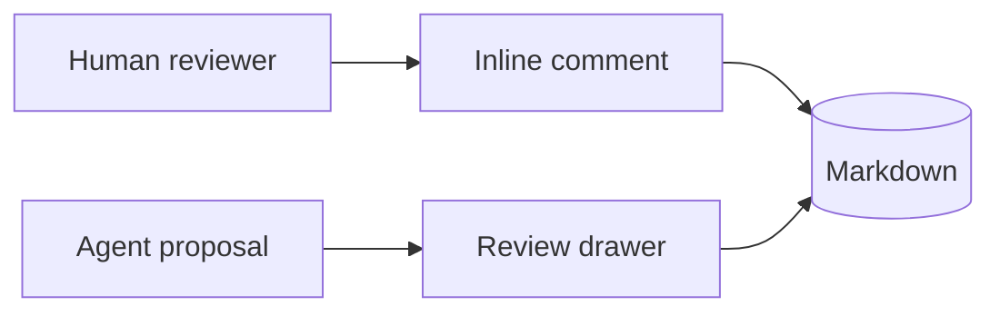

# Agent Handoff Review

Fold should let a human open a project, inspect what agents changed, and respond
directly inside the Markdown file. The document should remain the center of
gravity while comments, suggestions, and handoff controls stay close enough to
use without taking over the page.

## Decisions

- [x] Keep raw Markdown as the durable project artifact.
- [x] Store review events as encrypted room records.
- [ ] Replace the textarea only after editor import/export fidelity is proven.
- [ ] Verify mobile comment flows against long reports.

## Current Room State

| Area | Owner | Status | Notes |
| --- | --- | --- | --- |
| Project files | Human | Stable | Folder navigation works across nested Markdown files |
| Inline comments | Human + agent | Active | Text-range anchors use quote and context metadata |
| Proposals | Agent | Active | File replacements are reviewable before accept |
| Versions | Human | Draft | Named checkpoints restore Markdown snapshots |

## Agent Notes

The next agent should preserve exact Markdown whenever it edits generated plans.
Pay special attention to `frontmatter`, task lists, tables, code fences, and
links. Small formatting changes can become noisy in review.

> Agent notes should be useful without becoming a noisy dashboard. The best
> version of this surface feels like a calm project editor that happens to
> understand encrypted collaboration.

## Diagram



## Patch Command

```bash
fold propose ./reports/agent-handoff-review.md \
  --room fold-ui \
  --path reports/agent-handoff-review.md \
  --title "Tighten handoff language" \
  --comment "Keep the document calm and reviewable"
```

## TypeScript Example

```ts
export function summarizeOpenWork(items: string[]): string {
  return items.map((item, index) => `${index + 1}. ${item}`).join("\n");
}
```

## Math And Links

Inline scoring can stay simple: $score = preserved / detected$.

```math
\text{fidelity} = \frac{\text{preserved Markdown features}}{\text{detected Markdown features}}
```

Reference the [Fold repository](https://github.com/wanderingspirit03/fold)
and keep image syntax portable:


## Open Review Items

1. Confirm that file comments open where users expect them.
2. Confirm that pending suggestions are visible without a permanent rail.
3. Confirm that bright mode preserves annotation contrast.
4. Confirm that editor candidate export does not rewrite this file.
